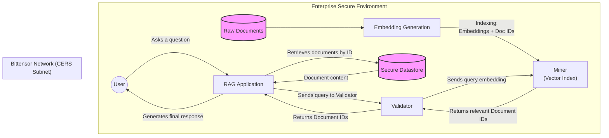

<div align="center">

# **Cohere Enterprise RAG Subnet** <!-- omit in toc -->
[](https://discord.gg/bittensor) <!-- TODO: Update with the project's Discord if applicable -->
[](https://opensource.org/licenses/MIT) 

---

## Powering Secure, High-Performance Enterprise RAG <!-- omit in toc -->

[Discord](https://discord.gg/bittensor) • [@cohere](https://x.com/cohere) • [Website](https://www.cohere.com)
</div>

---
- [Introduction](#introduction)
- [What This Subnet Solves for an Enterprise](#what-this-subnet-solves-for-an-enterprise)
- [How it works on Bittensor](#how-it-works-on-bittensor)
- [🔒 Security and Data Privacy](#-security-and-data-privacy)
  - [Architecture Overview](#architecture-overview)
- [Getting Started](#getting-started)
  - [Prerequisites](#prerequisites)
  - [1. Clone \& Install](#1-clone--install)
  - [2. Configure Your Wallet](#2-configure-your-wallet)
  - [3. Run](#3-run)
    - [For Miners](#for-miners)
    - [For Validators](#for-validators)
- [License](#license)

---
## Introduction

Unlock the full potential of your enterprise data with the **Cohere Enterprise RAG Subnet**. In today's AI-driven landscape, leveraging proprietary information is the key to a competitive edge. However, building and scaling a secure, high-performance Retrieval-Augmented Generation (RAG) system presents a significant challenge for many organizations.

This Bittensor subnet provides a decentralized, incentivized solution. It allows enterprises to supercharge their AI applications with their own private data, tapping into a competitive network of retrieval models without ever compromising on security or performance.

## What This Subnet Solves for an Enterprise

By participating in the CERS subnet, businesses can overcome common RAG hurdles and gain a distinct advantage:

-   **🚀 Superior RAG Performance**: Move beyond generic retrieval models. Leverage a global network of miners who are incentivized to develop and operate highly specialized and optimized retrieval algorithms tailored to your specific domain and data types.

-   **🔒 Uncompromised Data Security**: Your proprietary documents and sensitive information **never** leave your secure environment. The subnet is designed with a privacy-first architecture that operates exclusively on non-reversible data embeddings. (See [Security and Data Privacy](#-security-and-data-privacy) for details).

-   **💰 Cost-Effective Scalability**: Offload the heavy computational and maintenance burden of indexing and retrieval to a decentralized network. This allows you to pay for top-tier performance without the massive overhead of building and maintaining complex infrastructure in-house.

-   **🧩 Unmatched Customization**: The subnet fosters a competitive ecosystem where miners can specialize in different industries (e.g., finance, healthcare, legal) and data formats. This gives you access to a marketplace of tailored solutions that best fit your unique business needs.

-   **🤝 Powered by Cohere & Bittensor**: This subnet brings together Cohere's leadership in enterprise-grade AI and Large Language Models with Bittensor's robust, decentralized incentive network, creating a powerful and reliable foundation for your RAG applications.

---

## How it works on Bittensor

This subnet leverages Bittensor's core incentive mechanism to create a competitive marketplace for high-performance information retrieval. Here's how the components work together:

-   **Validators as Enterprise Proxies**: Validators act on behalf of an enterprise. They send query embeddings (derived from user questions) to the network of miners. Their primary role is to evaluate the quality and relevance of the miners' responses.

-   **Miners as Specialized Retrieval Engines**: Miners are the workhorses of the subnet. Their job is to:
    1.  Securely receive and index document embeddings provided by the enterprise via a private API.
    2.  Run sophisticated, high-speed search algorithms to find the most relevant document embeddings for a given query embedding.
    3.  Return a ranked list of document IDs to the validator.

-   **Incentivizing Performance with TAO**: The magic happens in the evaluation step.
    1.  Validators use a benchmark dataset (a set of queries with known relevant document IDs) to score the responses from each miner.
    2.  Performance is measured based on retrieval accuracy (e.g., precision, recall, MRR).
    3.  Based on these scores, validators set weights on the Bittensor network. Miners who consistently provide the most accurate and fastest results receive a larger share of the network's TAO rewards.

This continuous cycle of competition and reward drives miners to constantly innovate and optimize their retrieval models, ensuring that enterprises always have access to a state-of-the-art, decentralized retrieval system for their RAG applications.

---

## 🔒 Security and Data Privacy

In an enterprise context, data privacy is paramount. This subnet is designed with a **privacy-first architecture** where sensitive enterprise data is never exposed to the public network or the miners.

### Architecture Overview

The following diagram illustrates the data flow and the separation of concerns between the enterprise environment and the Bittensor network, ensuring that raw data never leaves the enterprise's secure perimeter.



Here’s how it works:
1.  **Data Stays On-Premise**: The enterprise's raw documents (the knowledge base) remain within their secure environment.
2.  **Embeddings, Not Data**: The enterprise generates numerical representations (embeddings) of their documents. Only these non-reversible embeddings, along with anonymous document IDs, are sent to the miners for indexing.
3.  **Miner's Role**: Miners store and maintain a searchable index of these embeddings. They perform similarity searches based on query embeddings provided by validators. **Miners never see the original document content.**
4.  **Secure Retrieval**: When a miner finds relevant results, it returns only the corresponding document IDs to the validator.
5.  **Final-Mile RAG**: The enterprise uses these IDs to retrieve the full document text from its own secure database to complete the RAG process.

This model ensures that companies can leverage the decentralized power of the Bittensor network for high-performance retrieval without ever compromising the confidentiality of their proprietary data.

---
## Getting Started

This guide provides the essential steps to get the Cohere Enterprise RAG Subnet up and running.

### Prerequisites

Before you begin, ensure you have the following installed:
- Python 3.8 or later
- `pip` and `venv`

You also need to have `bittensor` installed. If you haven't installed it yet, follow the instructions here.

### 1. Clone & Install

First, clone the repository and navigate into the directory:
```bash
git clone https://github.com/CohereAI-Labs/cers-subnet.git
cd cers-subnet
```

Next, set up a virtual environment and install the necessary dependencies. Using a virtual environment is highly recommended.
```bash
# Create and activate a virtual environment
python -m venv venv
source venv/bin/activate  # On Windows, use: venv\Scripts\activate

# Install the package in editable mode
pip install -e .
```

### 2. Configure Your Wallet

To interact with the Bittensor network, you need a wallet with a coldkey and a hotkey.
If you don't have one, create it using the Bittensor CLI (`btcli`):
```bash
# Create a new coldkey
btcli wallet new_coldkey --wallet.name my_wallet

# Create a new hotkey for your wallet
btcli wallet new_hotkey --wallet.name my_wallet --wallet.hotkey default
```

### 3. Run

You can participate in the subnet as either a miner or a validator.

#### For Miners

Miners are the core of the CERS subnet, responsible for indexing and retrieving information. For detailed instructions on how to set up and run a miner, including hardware requirements and configuration, please refer to the **[Miner README](./neurons/miners/README.md)**.

#### For Validators

Validators are responsible for evaluating miners and ensuring the integrity of the network. For detailed instructions on how to set up and run a validator, please refer to the **[Validator README](./neurons/validators/README.md)**.

For more detailed instructions, including how to register your keys and run on different networks (local, testnet, mainnet), please refer to our full documentation:
- Running Subnet Locally
- Running on the Test Network
- Running on the Main Network


## License
This repository is licensed under the MIT License.
```text
# The MIT License (MIT)
# Copyright © 2024 Cohere

# Permission is hereby granted, free of charge, to any person obtaining a copy of this software and associated
# documentation files (the “Software”), to deal in the Software without restriction, including without limitation
# the rights to use, copy, modify, merge, publish, distribute, sublicense, and/or sell copies of the Software,
# and to permit persons to whom the Software is furnished to do so, subject to the following conditions:

# The above copyright notice and this permission notice shall be included in all copies or substantial portions of
# the Software.

# THE SOFTWARE IS PROVIDED “AS IS”, WITHOUT WARRANTY OF ANY KIND, EXPRESS OR IMPLIED, INCLUDING BUT NOT LIMITED TO
# THE WARRANTIES OF MERCHANTABILITY, FITNESS FOR A PARTICULAR PURPOSE AND NONINFRINGEMENT. IN NO EVENT SHALL
# THE AUTHORS OR COPYRIGHT HOLDERS BE LIABLE FOR ANY CLAIM, DAMAGES OR OTHER LIABILITY, WHETHER IN AN ACTION
# OF CONTRACT, TORT OR OTHERWISE, ARISING FROM, OUT OF OR IN CONNECTION WITH THE SOFTWARE OR THE USE OR OTHER
# DEALINGS IN THE SOFTWARE.
```
